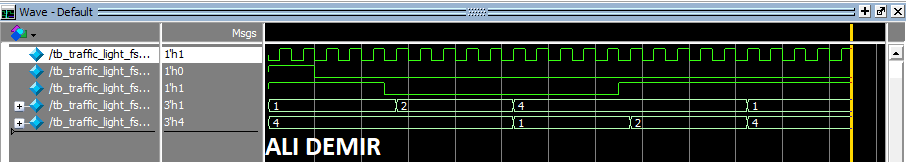

# 🚦 Traffic Light FSM

## 🧪 Simulation Result



---

## 📌 Overview

This project implements a **4-state Traffic Light Controller** using **SystemVerilog** and simulates its behavior using **Questa/ModelSim**.

The system controls traffic lights for two directions:

* **Street A (LA)**
* **Street B (LB)**

At any time, only one street has a green light while the other remains red.

---

## 🔁 FSM States

| State | LA (Street A) | LB (Street B) | Description  |
| ----- | ------------- | ------------- | ------------ |
| S0    | 🟢 Green      | 🔴 Red        | A is active  |
| S1    | 🟡 Yellow     | 🔴 Red        | A is slowing |
| S2    | 🔴 Red        | 🟢 Green      | B is active  |
| S3    | 🔴 Red        | 🟡 Yellow     | B is slowing |

### State Sequence

```id="k0l1z2"
S0 → S1 → S2 → S3 → S0
```

---

## ⏱️ Timing

* Yellow states (**S1** and **S3**) last **5 clock cycles**
* Controlled by an internal **timer**

---

## 📥 Inputs

* `clk` → Clock signal
* `reset` → Reset signal
* `TAORB` → Traffic selector

---

## 📤 Outputs

* `LA[2:0]` → Traffic light for Street A
* `LB[2:0]` → Traffic light for Street B

### Encoding

| Value | Meaning |
| ----- | ------- |
| `001` | Green   |
| `010` | Yellow  |
| `100` | Red     |

---

## 📁 Files

* `traffic_light_fsm.sv` → FSM design
* `tb_traffic_light_fsm.sv` → Testbench

---

## 🚀 Run Simulation

```id="q9w8e7"
vlib work
vlog traffic_light_fsm.sv
vlog tb_traffic_light_fsm.sv
vsim tb_traffic_light_fsm
add wave *
run 500ns
```

---

## ⚙️ Tools

* Intel Quartus Prime Lite
* Questa / ModelSim
* SystemVerilog

---

## 👨‍💻 Author

Ali Demir
